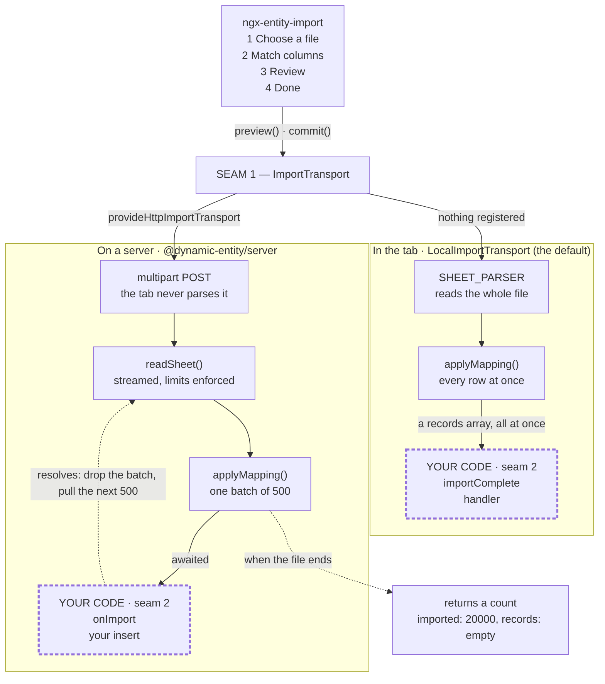

# Dynamic Entity Ecosystem 🚀

> Declarative form engine & visual schema builder for Angular 17–22

[](https://www.npmjs.com/package/@dynamic-entity/core)
[](https://www.npmjs.com/package/ngx-dynamic-entity)
[](https://www.npmjs.com/package/ngx-dynamic-entity-builder)
[](https://www.npmjs.com/package/@dynamic-entity/server)
[](https://angular.io/)
[](LICENSE)

**Dynamic Entity** renders tabbed, deeply nested forms from a declarative `EntityFormConfig` schema, evaluates reactive rules as values change, applies role-based field visibility and masking, and ships a visual editor for authoring those schemas.

---

## 📦 Published Packages

| Package | Version | Description |
|---|---|---|
| [`@dynamic-entity/core`](./packages/core) | [](https://www.npmjs.com/package/@dynamic-entity/core) | Framework-agnostic schema models, pure form logic, and the rules evaluator. No Angular, no RxJS. |
| [`ngx-dynamic-entity`](./packages/ngx-dynamic-entity) | [](https://www.npmjs.com/package/ngx-dynamic-entity) | Angular standalone form renderer and tabbed record editor. |
| [`ngx-dynamic-entity-builder`](./packages/ngx-dynamic-entity-builder) | [](https://www.npmjs.com/package/ngx-dynamic-entity-builder) | Standalone visual builder for authoring `EntityFormConfig` schemas. |
| [`@dynamic-entity/server`](./packages/server) | [](https://www.npmjs.com/package/@dynamic-entity/server) | Node-only. Streaming spreadsheet import for files too large to hold in a browser, with an Express adapter. |
| `demo-angular` | — | Showcase application with the Playwright E2E suite. Not published. |

All four share a version and are released together. Only the first two are needed to render a
form; the builder is for authoring schemas, and the server is for importing files a browser
cannot hold.

---

## ✨ Features

- **21 field types** — `text`, `textarea`, `markdown`, `number`, `currency`, `email`, `password`, `date`, `datetime`, `time`, `monthYear`, `dropdown`, `radio`, `checkbox`, `boolean`, `multiSelect`, `entity-ref`, `group`, `array`, `image`, `file`. Every type is a standalone component you can register individually, or swap for your own.
- **Field help text** — `hint` on any field puts an info icon beside its label, with the text on hover and for as long as the field has focus. It is wired to the control through `aria-describedby`, so a screen reader gets it without hovering anything. Unlike a `placeholder` it does not vanish at the first keystroke, which is what makes it usable for a format or a rule rather than an example. `LocalizedText`, like every other authored string.
- **A refused save explains itself** — pressing Save on an invalid form names every field at fault *and what is wrong with it*, badges each tab with its count, and jumps to the first. Save stays clickable while a form is merely invalid: a disabled button cannot say why.
- **Reactive rules engine** — three action types (`visibility` to show/hide a field or tab, `validation` to attach an error or warning, `info` to raise a banner) driven by 18 condition operators including `EQUAL`, `CONTAINS`, `IN`, `DATE_BEFORE`, `HAS_ITEMS` and `VALUE_CHANGED`. Conditions within a rule are ANDed; rules apply in `priority` order.
- **Role-based field visibility & masking** — per-entity `view`/`edit`/`delete` role lists, plus `maskData` to render a field as `XXXXXXXXX` for configured roles (override the text with `MASKED_PLACEHOLDER`). **This is presentational only — see [Security](#-security).**
- **Cross-entity referenced fields** — link a field to a source entity, snapshot what was copied, and detect drift when the source changes. Drift is surfaced in the builder.
- **Sync and async validation** — built-in validators, your own by name, and async checks against a server. A form cannot be submitted while an async check is pending, and a `beforeSave` hook can abort the save outright — from the whole-record Save and the record view's per-tab save alike, with `(saveRejected)` saying why.
- **Named lookup lists** — sync or async master lists resolved by name, with localized labels, fallbacks, and an integrity report for values that no longer match any option.
- **Spreadsheet import** — a four-step wizard that derives its own columns from the config, generates a matching CSV or `.xlsx` template, suggests a mapping and reports every row it could not take. Works with **no backend**; add `@dynamic-entity/server` and the identical wizard streams a fifty-thousand-row workbook a tab could never hold. See [Spreadsheet import](#-spreadsheet-import).
- **Visual builder** — click-to-add palette, drag-and-drop reordering, and a recursive tree editor for tabs, sub-tabs, groups, and arrays.
- **Localizable end to end** — config labels, placeholders and options are `LocalizedText` keyed by language; the libraries' own chrome (Save, Reset, "No rows yet.", every builder panel) resolves through `uiText` / `BUILDER_TEXT`, either as `LocalizedText` per key or through a resolver into an existing i18n layer.
- **Configurable date display** — `date` / `datetime` / `time` format through `setDateFormatters` in `@dynamic-entity/core`. The default stays the browser's locale, not the form's `language`.
- **100% standalone** — every component is `standalone: true`; the packages contain no `NgModule`. Signals are used for internal state; component inputs and outputs are decorator-based.

---

## 🚀 Quick Start

### 1. Installation

```bash
npm install @dynamic-entity/core ngx-dynamic-entity
```

Add the builder only if you need the visual schema editor:

```bash
npm install ngx-dynamic-entity-builder
```

### 2. Register the providers

Field types are **not** registered automatically — this is what keeps unused ones out of your bundle. Without this step the form renders no fields.

```typescript
// app.config.ts
import { ApplicationConfig } from '@angular/core';
import { provideNgxDynamicEntity, provideBuiltInFieldTypes } from 'ngx-dynamic-entity';

export const appConfig: ApplicationConfig = {
  providers: [
    provideNgxDynamicEntity({}),
    provideBuiltInFieldTypes(), // or provideFieldTypes({ text: TextFieldComponent, ... })
  ],
};
```

### 3. Render a form

```typescript
import { Component } from '@angular/core';
import { DynamicFormComponent } from 'ngx-dynamic-entity';
import type { EntityFormConfig } from '@dynamic-entity/core';

@Component({
  selector: 'app-record-editor',
  standalone: true,
  imports: [DynamicFormComponent],
  template: `
    <ngx-dynamic-form
      [config]="config"
      [initialData]="record"
      [userRoles]="roles"
      (formSubmit)="onSave($event)"
    />
  `,
})
export class RecordEditorComponent {
  config: EntityFormConfig = {
    entity: 'client',
    version: 1,
    name: { en: 'Client Profile' },
    tabs: [
      {
        id: 'general',
        label: { en: 'General' },
        visibility: true,
        flatData: true, // store this tab's fields at the record root — see "Record shape"
        fields: [
          { id: 'firstName', type: 'text', label: { en: 'First Name' }, visibility: true, validators: { required: true } },
          { id: 'lastName', type: 'text', label: { en: 'Last Name' }, visibility: true, validators: { required: true } },
          { id: 'email', type: 'email', label: { en: 'Email' }, visibility: true, validators: { required: true } },
        ],
      },
    ],
  };

  record: Record<string, unknown> = { firstName: 'Alice', lastName: 'Smith' };
  roles: string[] = ['editor'];

  onSave(value: Record<string, unknown>): void {
    console.log('Saved record:', value);
  }
}
```

---

## 🗂 Record shape

**This is the most common source of confusion — read it before wiring up `initialData`.**

By default a record is **nested by tab id**:

```typescript
const record = { general: { firstName: 'Alice' }, billing: { vatNumber: 'GB123' } };
```

Set `flatData: true` on a tab to store that tab's fields at the record root instead:

```typescript
const record = { firstName: 'Alice', lastName: 'Smith' };
```

The same shape applies in **both directions**: `initialData` is read with it, and `(formSubmit)` emits with it. Passing a flat record to a tab that is not marked `flatData` leaves those fields empty — the values are simply not found where the form looks for them.

---

## ✅ Validating a config

A config is data — authored in the builder, stored, fetched from an API — so TypeScript cannot
police it. Check one before anything renders it:

```typescript
import { validateConfig, formatConfigProblems, type EntityFormConfig } from '@dynamic-entity/core';

declare const config: EntityFormConfig;

const problems = validateConfig(config);
if (problems.some(p => p.level === 'error')) {
  throw new Error(`Invalid config:
${formatConfigProblems(problems)}`);
}
```

It reports every problem rather than stopping at the first, and catches what a type cannot:
a field type absent from the catalog, two fields sharing an id **in the same scope**, a
`showWhen` naming a field that does not exist, a cascade whose `parentField` is missing,
and — when you pass them — a rule whose trigger, comparison field or field target cannot
resolve. Bracketed paths (`[work.address]`) name one field; a bare id is still accepted
while only one scope defines it.

Field ids are unique per scope, not globally — a record nests by tab, so `address` on
Personal Details and `address` on Work Details are two different fields and store as
`{ personal: { address }, work: { address } }`. A scope is whatever the record nests under:
each tab, each `group` field, and the parent's level for a `flatData` tab. What you cannot
duplicate is an id something *points at* by bare name: `showWhen`, cascade `parentField`
and (when supplied) rules name a field by id with no scope, so an id defined in two scopes
is reported as ambiguous the moment a reference uses it. Name it by path instead. `warning`
means usable but suspicious; `error` means it will not render correctly.

Pass `additionalFieldTypes` for any type you registered yourself.

The same check is a command, so a consumer CI job can fail a bad config before it is stored:

```bash
npx dynamic-entity validate ./form-config.json
```

`--additional-field-types signature,rating` matches `additionalFieldTypes`. `--rules rules.json`
passes a `FormRule[]` so CI can gate rule references the same way. `--fail-on-warnings`
treats a warning as a failure. Exit `0` means no errors, `1` means the config is unusable,
`2` means the file or the JSON itself is.

For editor completion, a JSON Schema ships too:

```json
{ "$schema": "./node_modules/@dynamic-entity/core/entity-form-config.schema.json", "entity": "clients", "tabs": [] }
```

---

## 🔄 Schema versioning

`EntityFormConfig.version` and a record's `_configVersion` describe which shape a record was
saved under. When you change a schema, raise `version` and register the steps that move old
records forward:

```typescript
import { provideNgxDynamicEntity } from 'ngx-dynamic-entity';
import type { RecordMigration } from '@dynamic-entity/core';

const migrations: RecordMigration[] = [
  {
    from: 1,
    to: 2,
    description: 'split name into firstName/lastName',
    migrate: record => {
      const [firstName = '', ...rest] = String(record['name'] ?? '').split(' ');
      const { name, ...others } = record;
      return { ...others, firstName, lastName: rest.join(' ') };
    },
  },
];

provideNgxDynamicEntity({ migrations });
```

Migrations run where a record enters the form, so nothing has to remember to call them. Steps
chain strictly (`1 → 2 → 3`); a gap **throws** rather than applying a partial upgrade, because
a half-migrated record matches neither schema.

Two behaviours worth knowing:

- **A record with no `_configVersion` is left alone.** Its version is genuinely unknown, and
  guessing wrong in either direction corrupts data. Pass `assumeVersion` to `migrateRecord`
  when you know what those records are.
- **A record newer than the config is never migrated downward.** That means a rolled-back
  deployment; downgrading would discard fields no step describes.

`migrateRecord`, `needsMigration`, `stampRecord` and `validateMigrations` are exported from
`@dynamic-entity/core` and are pure, so the same migration set runs on a server before
persisting.

---

## 📥 Spreadsheet import

A config already describes every field, its type, its validators and its options — which is
enough to derive the columns a spreadsheet may carry, generate a template shaped like them, and
map an uploaded file back onto records. None of that is authored twice.

The wizard is one component and works with **no backend at all**. Registering
`@dynamic-entity/server` moves the same import onto a server for files a tab cannot hold; the
wizard does not change, because it already talks to a transport.



**Both lanes call the same `applyMapping` from `@dynamic-entity/core`**, so a row imported in a
tab and the same row imported on a server produce the same record. That parity is asserted
across every config in the repository, through three paths — in-browser, CSV on a server, and a
typed `.xlsx` workbook — rather than being claimed.

### The library never writes anywhere

Both paths end at code you write. Seam 2 is where it stops:

```html
<!-- In the tab — an output you subscribe to. -->
<ngx-entity-import [config]="config" [rules]="rules" (importComplete)="onImported($event)" />
```

```typescript
import type { ImportResult } from '@dynamic-entity/core';

declare const store: { create(entity: string, record: Record<string, unknown>): void };

export class ImportPageComponent {
  entity = 'clients';

  // The wizard has stored nothing of its own. If you don't handle this, the import is a no-op.
  onImported(result: ImportResult): void {
    for (const record of result.records) store.create(this.entity, record);
  }
}
```

```ts
// On a server — a function you hand the router.
import { createImportRouter } from '@dynamic-entity/server/express';
import type { EntityFormConfig, ImportLookups } from '@dynamic-entity/core';

// Your own — the configs you authored, the lists they resolve against, your database.
declare const configs: Record<string, EntityFormConfig>;
declare const lookups: ImportLookups;
declare const db: { insertMany(entity: string, rows: Record<string, unknown>[]): Promise<void> };

export const importRouter = createImportRouter({
  configs,
  lookups,
  // Called once per batch and awaited; `request` is where your auth context lives.
  async onImport(records, { entity, request }) {
    await db.insertMany(entity, records);
  },
});
```

That `await` is the backpressure. A consumer writing to a database is slower than a parser
reading a file, so the run does not touch the source again until your insert resolves — which
is what makes peak memory a function of the batch size rather than of the file. Measured on a
50,000-row, 35-column sheet: **2.7 MB** of collected heap.

Four things worth knowing before you wire it up:

- **On the server path `result.records` arrives empty** and `imported` carries the count.
  Shipping 20,000 records back over the wire would undo the streaming. Read
  `imported ?? records.length`, and `failed` for the rows that did not make it — never the
  distinct rows in `errors`, which is a capped sample and will under-report.
- **`onImport` must be idempotent.** An import is not transactional: a failure at row 30,000
  leaves 29,999 written, and clients retry. `POST /:entity/validate` runs the identical pipeline
  and writes nothing.
- **There is no deduplication**, because a config has no natural-key concept to deduplicate on.
- **The router has no authentication.** It is an upload endpoint; guarding it is yours.

Fields a cell cannot carry — `image`, `file`, an array nested inside another array — are
*reported* rather than dropped, because a missing column looks identical to one nobody thought
of. `[templateFormat]="'xlsx'"` writes a real workbook through a server transport, and is
refused by name in a CSV-only build rather than producing a CSV under an `.xlsx` name.

See [EXTENDING.md](./EXTENDING.md#spreadsheet-import) for the column contract, `maxArrayRows`
and the validation-parity gap, and [`@dynamic-entity/server`](./packages/server) for limits,
formats and deployment notes.

---

## 🔐 Security

`EntityPermissions` (`view` / `edit` / `delete` role lists) and `maskData` control **what the browser renders**. They are a UI convenience, not an access-control boundary:

- A masked value is replaced with `XXXXXXXXX` by default (`MASKED_PLACEHOLDER` overrides the text), but the real value remains in the form control and is included in the `(formSubmit)` payload.
- Any role check performed here runs on the client and can be bypassed.

**Authorize on the server.** Never send a user data they are not permitted to see, and re-check every permission when the submitted record reaches your API.

---

## 🎭 Presentation

The masked placeholder and date punctuation were literals until they were asked about, so
neither could be changed. Both keep their previous default: an unconfigured install looks
exactly as it did.

```typescript
import { ApplicationConfig } from '@angular/core';
import { MASKED_PLACEHOLDER, provideNgxDynamicEntity } from 'ngx-dynamic-entity';

export const maskedPlaceholderConfig: ApplicationConfig = {
  providers: [
    provideNgxDynamicEntity({}),
    { provide: MASKED_PLACEHOLDER, useValue: '••••••••' },
  ],
};
```

Dates format in the **browser's** locale, not the form's `language` — `language` selects
which `LocalizedText` key to read. To tie them together, or to fix a format:

```typescript
import { setDateFormatters } from '@dynamic-entity/core';

setDateFormatters({
  date: (value, lang) => value.toLocaleDateString(lang ?? []),
});
```

A partial object overrides one kind; `setDateFormatters()` with no argument restores the
defaults. It reaches every read-only `date`, `datetime` and `time` field and the record
view's summary panel — the same value never punctuates two ways on two surfaces. Full
notes: [Presentation defaults](EXTENDING.md#presentation-defaults).

---

## 🎨 Styling

Field components emit stable BEM-style hooks — `ngx-field`, `ngx-field__label`,
`ngx-field__input`, `ngx-field__error` — and **no styles are applied unless you ask for
them**. The library has no Angular Material dependency and imposes no design system, so it
drops into a Tailwind, CSS-modules or hand-rolled setup without conflict.

An optional base stylesheet ships alongside it, for when you would rather start from
something legible than from browser defaults:

```css
/* angular.json → styles, or a global stylesheet */
@import 'ngx-dynamic-entity/styles.css';
```

It is driven entirely by custom properties, scoped to `.ngx-form` / `.ngx-record-editor` so
importing it cannot affect the rest of your app. Re-skin it by redeclaring the tokens on the
same selectors — nothing else needs overriding:

```css
.ngx-form,
.ngx-record-editor {
  --ngx-color-accent: #4f46e5;
  --ngx-color-border: #e2e8f0;
  --ngx-radius-sm: 8px;
  --ngx-control-height: 40px;
}
```

Dark mode follows `prefers-color-scheme`; pin it either way by redeclaring the palette.
Two behaviours are opt-in rather than default:

| Add this | To get |
|---|---|
| `ngx-form-sticky-actions` on a wrapper | A Save/Reset bar that stays in view down a long form. Opt-in because `position: sticky` resolves against the nearest scrolling ancestor, so a form embedded mid-page would detach its bar and float it over whatever is below. |
| `layout="auto"` on the component | Fields with no `colSpan` of their own sized by type — a date is a third of a row, a textarea still takes all twelve — instead of every field taking the full width. |

`packages/demo-angular/src/styles.css` shows the whole arrangement: it imports the
stylesheet, overrides the tokens, and adds only its own chrome.

> The **builder** does depend on Angular Material and requires `provideAnimations()`.

---

## 🖥 Server-side rendering

The renderer is intended to work under Angular SSR. Templates use Angular APIs
(`afterNextRender`, `ElementRef`, `@HostListener`) rather than the global `document` or
`window`, so a server render does not throw. CI runs `renderApplication` against the
published tarballs on Angular 20.

The builder is a Material visual editor with drag-and-drop. It is not an SSR target; host
it in a browser-only route.

The renderer does not use `NgZone`. It is intended to work under
`provideZonelessChangeDetection()` (Angular 20+). The demo app still loads `zone.js`
because it is an Angular Material application. CI `renderApplication`s a form
zonelessly on Angular 20.

---

## 🧪 Testing

```bash
npm test          # unit tests across all workspace packages
npm run build     # build every package
npm run lint      # type-check every package, and check that the demo still
                  # wires every extension point (scripts/check-demo-coverage.mjs)

# Playwright E2E (from the demo app)
cd packages/demo-angular && npx playwright test
```

---

## 🧩 Extending

Custom field types, validators, validation messages and i18n, the masked placeholder, date
formatters, upload handlers, entity-ref loaders, lookup lists, and the programmatic form
API: see [EXTENDING.md](EXTENDING.md).

Start with [how a field is addressed](EXTENDING.md#how-a-field-is-addressed). Field ids are
unique **per scope**, not per config — `personal.address` and `work.address` are two
different fields — and `showWhen`, cascades, `autoPatch`, rules and the submitted record all
name fields by that model.

---

## 📝 Changelog

See [CHANGELOG.md](CHANGELOG.md). The three packages share a version and are released
together.

---

## 📄 License

[MIT](LICENSE) © Nizamudeen
